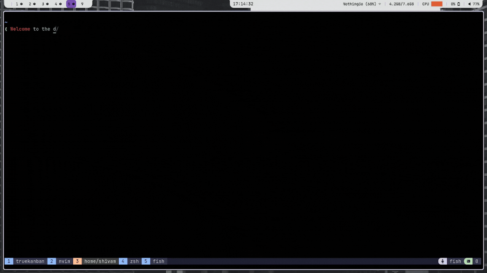

# TrueKalender

A terminal-based calendar and task manager built with [Bubble Tea](https://github.com/charmbracelet/bubbletea). Navigate months, track daily tasks, and sync to a kanban board — all from your terminal.

---
## Demo



---

## Features

- Monthly calendar view with keyboard navigation
- Per-day task list in a side panel
- Add tasks to any day via an inline form
- Sync tasks to an external kanban board's SQLite database
- Adapts to terminal size with a minimum-size guard
- Persistent storage via SQLite (no external server needed)

---

## Prerequisites

- A terminal emulator (Linux/macOS) or PowerShell (Windows)
- GCC is bundled into the pre-built binaries — only needed if [building from source](./CONTRIBUTING.md)

---

## Installation

### Linux (x64)

```bash
curl -L https://github.com/Shivam583-hue/TrueKalender/releases/latest/download/truekalender-linux-amd64 -o truekalender
chmod +x truekalender
sudo mv truekalender /usr/local/bin/
truekalender
```

### macOS (Apple Silicon)

```bash
curl -L https://github.com/Shivam583-hue/TrueKalender/releases/latest/download/truekalender-macos-arm64 -o truekalender
chmod +x truekalender
sudo mv truekalender /usr/local/bin/
truekalender
```

### macOS (Intel)

```bash
curl -L https://github.com/Shivam583-hue/TrueKalender/releases/latest/download/truekalender-macos-amd64 -o truekalender
chmod +x truekalender
sudo mv truekalender /usr/local/bin/
truekalender
```

### Windows (PowerShell)

```powershell
curl.exe -L https://github.com/Shivam583-hue/TrueKalender/releases/latest/download/truekalender-windows-amd64.exe -o truekalender.exe
move truekalender.exe C:\Windows\System32\truekalender.exe
truekalender
```

> **Note:** Binaries are built with CGO (for SQLite). If you encounter issues, ensure you have GCC installed.
> On Ubuntu/Debian: `sudo apt install gcc` — On macOS: `xcode-select --install`

---

## Keybindings

### Calendar View

| Key | Action |
|---|---|
| `h` / `←` | Previous day |
| `l` / `→` | Next day |
| `j` / `↓` | One week forward |
| `k` / `↑` | One week back |
| `H` | Previous month |
| `L` | Next month |
| `n` | New task for selected day |
| `s` | Sync selected day's tasks to kanban |
| `q` / `ctrl+c` | Quit |

### Form View

| Key | Action |
|---|---|
| `enter` | Save task |
| `esc` | Cancel and return to calendar |
| `ctrl+c` | Quit |

---

## Project Structure

```
TrueKalender/
├── main.go               # Entry point — wires DB, model, and Bubble Tea program
├── go.mod
├── go.sum
├── .github/
│   └── workflows/
│       └── main.yml      # Release workflow: builds binaries for all platforms
├── db/
│   └── db.go             # SQLite helpers: Init, Insert, FetchByDate, CountByDate, Close
├── model/
│   ├── model.go          # Main calendar model: state, Update loop, View rendering
│   ├── form.go           # Task creation form model
│   ├── renderPanel.go    # Side panel rendering (day task list)
│   └── sync.go           # Kanban sync command
└── styles/
    └── styles.go         # Lipgloss style definitions
```

---

## Contributing

See [CONTRIBUTING.md](./CONTRIBUTING.md).
